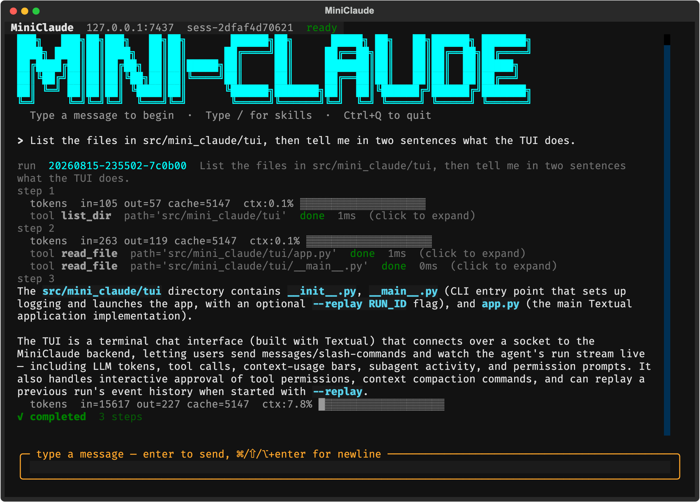

# Mini-Claude



Mini-Claude is a small local coding-agent runtime built with Python, Anthropic Claude,
and Textual. It separates the agent core from its terminal clients, so a CLI or TUI can
connect to the same long-running daemon and observe work through a shared event stream.

The project is intended for learning and experimentation. It implements the important
parts of a coding agent without trying to reproduce every Claude Code feature.

## What it includes

- A multi-step agent loop with streamed model output and tool calls
- A persistent core daemon with CLI and Textual TUI clients
- Multi-turn sessions, notes, project context, and conversation compaction
- Permission prompts for shell commands, file writes, and unknown tools
- Built-in filesystem, shell, task-tracking, and memory tools
- Skills loaded from Markdown files
- Agent profiles and foreground/background subagents
- MCP servers over stdio or TCP
- Structured events, trace logs, and run replay

## Requirements

- Python 3.12
- An Anthropic API key
- [`uv`](https://docs.astral.sh/uv/) is recommended for dependency management
- Node.js is required only when an MCP server is launched through `npx`

## Installation

Clone the repository and install the locked dependencies:

```bash
uv sync --dev
```

Create a `.env` file in the project root:

```dotenv
ANTHROPIC_API_KEY=your_api_key_here
```

Do not commit `.env`; it is ignored by Git.

## Quick start

Mini-Claude uses a daemon/client architecture. Start the core in one terminal:

```bash
uv run claude-core
```

Then start the TUI in another terminal:

```bash
uv run claude-tui
```

The TUI supports:

- `Enter` to send
- `Shift+Enter`, `Alt+Enter`, or `Ctrl+J` for a newline
- `/` to browse available skills
- `Ctrl+Q` to quit

You can also use the CLI:

```bash
uv run claude ping
uv run claude chat
uv run claude run --goal "Review src/mini_claude/core/loop.py"
uv run claude trace
```

Replay a previous run in the TUI:

```bash
uv run claude-tui --replay RUN_ID
```

## Configuration

Configuration is loaded in this order:

1. Built-in defaults
2. `~/.mini/config.toml`
3. `.mini/config.toml`
4. `CLAUDE_*` environment-variable overrides

Example `.mini/config.toml`:

```toml
[core]
host = "127.0.0.1"
port = 7437

[agent]
max_steps = 20

[llm]
default_model = "claude-sonnet-4-6"
router = "static"

[logging]
level = "INFO"
file = "~/.mini/logs/core.log"
format = "text"

[trace]
enabled = true
file = "~/.mini/traces/daemon.jsonl"
include_llm_payload = true

[permission]
timeout_s = 60

[compact]
auto_threshold = 0.8
tool_result_limit = 8000
tool_result_keep = 4000
```

Useful environment overrides include:

```dotenv
CLAUDE_HOST=127.0.0.1
CLAUDE_PORT=7437
CLAUDE_LLM_DEFAULT_MODEL=claude-sonnet-4-6
CLAUDE_MAX_STEPS=20
CLAUDE_LOG_LEVEL=INFO
CLAUDE_TRACE_ENABLED=true
```

Restart the daemon after changing configuration or core code.

## Built-in tools

| Tool | Purpose |
| --- | --- |
| `read_file` | Read a workspace file |
| `write_file` | Create or replace a workspace file |
| `list_dir` | Inspect a directory tree |
| `bash` | Run a non-interactive shell command |
| `task_create` | Create a tracked unit of work |
| `task_get` | Read one tracked task |
| `task_list` | List tracked tasks |
| `task_update` | Update status or dependencies |
| `note_save` | Save durable session notes |
| `subagent` | Delegate work to an agent profile |
| `agent_result` | Read a background subagent result |

MCP tools are added to the same registry when MCP servers are configured.

## Skills and agent profiles

Skills are Markdown prompt templates discovered from:

- `.mini/skills/`
- `~/.mini/skills/`
- Built-in skills under `src/mini_claude/core/skills/builtin/`

A skill may be stored as `name.md` or `name/SKILL.md`. Invoke it from a chat session
with `/name arguments`.

Agent profiles are TOML files discovered from:

- `.mini/agents/`
- `~/.mini/agents/`
- Built-in profiles under `src/mini_claude/core/agent/builtin/`

Profiles can provide a description, system prompt, and tool allowlist. A model field is
parsed as metadata, but the current subagent runtime reuses its parent model provider.
The built-in profiles are `planner`, `executor`, and `reviewer`.

## MCP

Add MCP servers to `.mini/config.toml`. For example, a stdio filesystem server:

```toml
[[mcp.servers]]
name = "filesystem"
transport = "stdio"
command = "npx"
args = ["-y", "@modelcontextprotocol/server-filesystem", "/path/to/allowed/root"]
```

Only expose directories and commands you intend the agent to access.

## Data and logs

Runtime data is stored under `~/.mini/`:

```text
~/.mini/
├── config.toml
├── policy.toml
├── logs/
├── sessions/
└── traces/
```

Trace payloads may include prompts, file contents, tool output, and model responses.
Disable payload capture when that data is sensitive:

```toml
[trace]
include_llm_payload = false
```

## Architecture

```text
CLI / TUI
    │
    │ JSON-RPC over NDJSON/TCP
    ▼
Core daemon
    ├── Session manager
    ├── Agent runner and loop
    ├── Anthropic provider
    ├── Tool and permission system
    ├── Skills, subagents, and MCP
    └── Event bus, session store, and trace writer
```

The current package implementation lives under `src/mini_claude/`. The older
root-level prototype files are not used by the installed `claude`, `claude-core`, or
`claude-tui` commands.

## Development

Run the test suite:

```bash
uv run pytest -q
```

Run linting and type checks:

```bash
uv run ruff check src tests
uv run mypy src
```

The project currently has focused regression coverage and is still under active
development. Use it carefully on important workspaces and review permission prompts
before allowing commands or writes.
